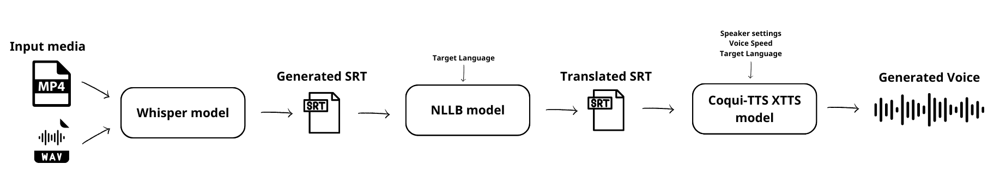

## Description
**NarratAI** is an AI-powered app built for [Akashathon](https://app.buidlbox.io/akash-network/akashathon-3),
running on the decentralized Akash Network . 
It processes audio and video files by transcribing speech into text, translating it into multiple languages, and generating AI-driven voiceovers. 
The app uses Whisper to create accurate transcriptions with word-level timestamps, enabling precise subtitles. 
It leverages the NLLB model to translate subtibles into many languages. 
For voiceovers, it uses Coqui-TTS, an advanced AI technology to generate natural-sounding voices, offering options for predefined voices, voice cloning, or using the original speaker's voice. 
**NarratAI** enhances media accessibility and localization while showcasing the power of decentralized infrastructure and AI.

## Motivation
The motivation behind building this app stemmed from my experience participating in Akash [Zealy](https://zealy.io/cw/akashnetwork/questboard) campaigns, 
where I deployed numerous AI models on the Akash Network. 
In some tasks, users were required to create video tutorials demonstrating their deployments. 
As someone who isn’t confident in my English accent, 
I thought it would be amazing to build an app that generates AI-powered voiceovers for such content. As I started developing the app, I realized it could go beyond just voiceovers. 
Adding a translation feature would make media accessible to a global audience, 
breaking language barriers and promoting inclusivity. 
This inspired me to create a tool that not only supports creators but also enhances accessibility for everyone.

## AI and Tech stack

1. [faster-whisper](https://github.com/SYSTRAN/faster-whisper):
   - A reimplementation of OpenAI's Whisper model using CTranslate2, which is a fast inference engine for Transformer models.
   - The [medium](https://huggingface.co/Systran/faster-whisper-medium) whisper model is used because it offers a nice tradeoff of speed and accuracy.
2. [No Language Left Behind](https://ai.meta.com/research/no-language-left-behind/):
   - Created by Meta, NLLB is a cutting-edge machine translation model designed to work with over 200 languages, including low-resource languages.
   - **NarratAI** uses the [nllb-200-distilled-600M](https://huggingface.co/facebook/nllb-200-distilled-600M) model.
3. [Coqui TTS](https://github.com/coqui-ai/TTS):
   - Coqui-TTS is an open-source AI-driven text-to-speech synthesis tool capable of generating natural, human-like voices.
   - [XTTSv2](https://docs.coqui.ai/en/latest/models/xtts.html) model is used that supports 17 languages and voice cloning.
4. [Gradio](https://www.gradio.app/)
   - Gradio is an open-source Python library that simplifies creating and sharing machine learning models and web-based user interfaces
    
## Application Flow  


The diagram illustrates the workflow of the **NarratAI** application, which processes media files to generate accessible content with transcription, translation, and AI voiceovers.

1. **Input**:  
   - The user uploads a video, audio or SRT file.  
     - Supported types: .mp4 .mkv .mov .mp3 .wav .flac .srt
     - Current max file size: 20MB 
   - If a video is uploaded, the app extracts the audio for further processing.  
   - If an SRT file is uploaded, the app skips the transcription step entirely.

2. **Transcription with Whisper**:  
   - The extracted audio is processed using the **Whisper** model to generate an accurate transcription.  
   - **Whisper** supports multilingual transcription and provides **word-level timestamps**, making it straightforward to create an **SRT file** with captions.  
   - To ensure smoother text-to-speech synthesis, **SRT segments** are refined to include full sentences or meaningful phrases.

3. **Translation with NLLB**:  
   - If the user specifies a language different from the original transcription, the **NLLB** model translates the SRT file.  
   - This results in a new SRT file with segments translated into the desired language, maintaining the original timing structure.  

4. **Voice Generation with XTTS**:  
   - The **XTTS** model is applied to each SRT segment to generate artificial speech.  
   - Users have several options for voice generation:
     - **Predefined Speakers**: Choose from a set of available voices.  
     - **Voice Cloning**: Submit their own recordings to clone their voice.  
     - **Input Media Voice Cloning**: Use the voice from the uploaded media file for cloning.  
     - Adjust the generated voice speed.

5. **Output Presentation**:  
   - The app combines the generated voice segments into a cohesive voiceover and presents the final output to the user. 
   - If the input media is video then it combines it with the generated voiceover in a new video.
   - The generated media can be downloaded.

## Examples

| Original                                  | Predefined Speaker - English | Predefined Speaker - Spanish | Voice Cloning - Japanese |
|-------------------------------------------|------------------------------|------------------------------|--------------------------|
|https://github.com/user-attachments/assets/b2ad070d-cb2b-4f77-a84a-cacd6011d430| https://github.com/user-attachments/assets/d2f941ed-3eeb-4eaa-9059-b2e9b19ca107| https://github.com/user-attachments/assets/e2d7b58d-eb90-46d6-ba0d-43dc3d06b3a7 | https://github.com/user-attachments/assets/3ed7d2dd-4a64-4b3e-abf5-4e2a28a3fcfd |


## Challenges and Limitations
Synchronizing an SRT file with AI-generated voice models poses several challenges due to differences in timing, speech dynamics, and model behavior. Here's why this process can be complex:
 1. **Text-to-Speech Timing Variability**
    - AI-generated voices, even with advanced models like **Coqui-TTS**, may not perfectly match the original audio timing.
    - Generated speech can vary in duration due to:
      - Differences in **speech speed** (AI voices may speak faster or slower than expected).
      - Changes in **pausing** or phrasing that differ from the original delivery.
2. **Subtitle Segmentation**
   - **SRT files** are often split into small segments based on word timestamps or pauses. However, AI-generated voices typically perform better with complete sentences or meaningful phrases.

To deal with these issues:
- The generated SRT segments are divided based on sentences, unless a sentence exceeds 40 words.
- A simple heuristic approach is developed, to adjust the generated voice speed based on the number of words in a segment and the available time. If a segment contains many words and has limited time, the voice speed will increase. Conversely, if a segment has fewer words or more time, the voice speed will decrease.

While these approaches improve the quality of the generated results, they still have limitations. For instance, voice generation for a segment must be repeated iteratively with increasing speed until it fits within the available time interval of the SRT segment. This iterative process slows down the overall voice generation, espesially for longer videos. 
For this reason, **NarratAI** currently supports media files up to 20MB and is not thoroughly tested on videos longer than 3 minutes.

## Run with Docker

To create the Docker image run from the project's root path:
```
docker build -t <user>/narratai:0.0.1 -f docker/Dockerfile .
```

Run the container:
```
docker run --gpus all -p 7860:7860 <user>/narratai:0.0.1 
```

## Deploy on Akash 


https://github.com/user-attachments/assets/f38d3ebb-902a-4d11-bb98-31388cffaf7f


 - Push docker image on [Docker hub](https://hub.docker.com/)
   - `docker push <user>/narratai:0.0.1`
   - or use the uploaded [image](https://hub.docker.com/repository/docker/cro7/narratai/general)
 - Create a [deployment](deploy.yaml) file using [Stack Definition Language](https://akash.network/docs/getting-started/stack-definition-language/)
 - Visit https://console.akash.network/
 - Create and fund a Keplr/Leap wallet, create an account to proceed with fiat payments, or start trial
   - [Keplr wallet](https://akash.network/docs/getting-started/token-and-wallets/#keplr-wallet)
   - [Leap wallet](https://akash.network/docs/getting-started/token-and-wallets/#leap-cosmos-wallet)
- Connect your wallet
  - You need to have at least 0.5 AKT in your wallet
- Press the deploy button
- Select "Run Custom Container"
- Select YAML tab and paste the [deploy.yaml](deploy.yaml) configuration
- Press "Create Deployment" and accept wallet transaction
- Review bids, select provider and accept wallet transaction
- Wait until container is up and go to LEASES tab to press the URI
- Check the [Akash console docs](https://akash.network/docs/getting-started/quickstart-guides/akash-console/) if you have and questions


## Future Work
There are a lot of things that can be improved in the app. Would be happy to get some help with the following:
- Include speaker diarization and generate different voice for different speakers
- Improve syncronization between SRT and generated voice segments
- Improve UI 
- Support longer videos by making the voice generation process faster

## Disclaimer

**NarratAI** is build for educational purposes and is not intented for commercial use.
